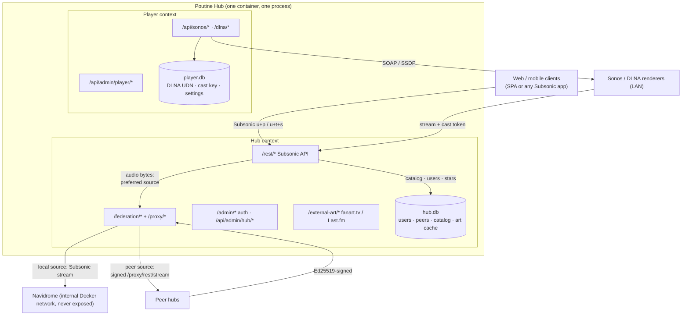
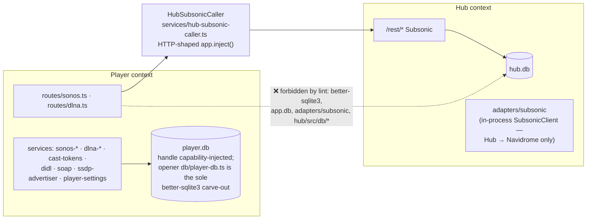

# System architecture

Federated music player. Mesh of independently-operated hubs; each bundles a private Navidrome and exposes a merged view of the federation. Protocol: [federation-api.md](federation-api.md). Engineering details: [hub-internals.md](hub-internals.md).

## Deployment

One Docker Compose stack per participant. Two services: hub (Fastify + SQLite, serves SPA on same port) and internal Navidrome (music files + transcoder, never exposed).



Navidrome credentials live in env vars, not the DB. SPA + API on one port. Audio is piped, never buffered on the hub — see [Play flow](#play-flow).

**Observability (#3).** Optional and key-gated. When `NEW_RELIC_LICENSE_KEY` is set, `hub/docker-entrypoint.sh` execs the hub under the New Relic APM agent (Fastify transactions, distributed tracing across `/proxy/*` peer calls, event-loop/GC metrics, pino logs-in-context) as APM entity `poutine-hub-<instance id>`. Without the key no agent code loads at all — there is no application-level integration to disable. Details: [hub-internals.md](hub-internals.md#observability-new-relic-apm-3).

## Layers

**Clients** — React SPA or any Subsonic-compatible app. Both speak `/rest/*` via `u+p` or `u+t+s` (MD5 token+salt). SPA logs in at `/admin/login`; see [authentication.md](authentication.md).

**Hub** — Fastify + better-sqlite3:

| Concern        | Responsibility                                                                                                                                                                           |
|----------------|------------------------------------------------------------------------------------------------------------------------------------------------------------------------------------------|
| Client API     | SPA + Subsonic `/rest/*` over unified library                                                                                                                                            |
| Sync + merge   | `syncLocal` from local Navidrome; `/proxy/rest/*` from peers; merge into unified tables                                                                                                  |
| Auto-sync      | `AutoSyncService`: trigger on Navidrome scan complete; fan out to peers per `SYNC_INTERVAL_MS`                                                                                           |
| Stream/art     | Route to source's Navidrome via `/proxy/*` (local or peer)                                                                                                                               |
| External art   | `/external-art/*`: fanart.tv (MBID) → Last.fm fallback → `art_cache`                                                                                                                     |
| Admin          | `/api/admin/hub/*` and `/api/admin/player/*` (owner-only). `/admin/*` reserved for auth (refresh-cookie path). `/api/invites/*` is public — invite redemption (#272).                    |
| Version signal | `GET /api/version` → `{ appVersion, buildId }` (#196). Unauthenticated, deliberately separate from `/api/health`, whose per-call Navidrome ping is too costly for one poll per open tab. |

**Navidrome** — private per hub. Driven entirely through Subsonic (`getArtists`, `getAlbum`, `stream`, `getCoverArt`, `getScanStatus`, `startScan`). Its native `/api/*` is unused.

## SPA admin split (issue #216, Phase 2 of #212)

The admin SPA exposes **two distinct top-level destinations** that never co-exist on the same page:

| Route           | Bounded dir                           | Owns                                                                             |
|-----------------|---------------------------------------|----------------------------------------------------------------------------------|
| `/admin/hub`    | `frontend/src/features/hub-admin/`    | Instance, peers, invitations, users, user invites, art cache, activity retention |
| `/admin/player` | `frontend/src/features/player-admin/` | LAN URL, Sonos casting, DLNA (#217), cast device settings                        |

`/admin/player` is gated on a `GET /player/health` probe (added in #216). When that probe is absent or non-200, the route renders a "Player not deployed on this host" placeholder and the sidebar destination hides. Today both sides always run in one process, so the probe always answers — but the gate means a future Hub-only deployment degrades gracefully with zero frontend changes.

Bounded directories may not cross-import. ESLint-level enforcement landed in #221 (`frontend/eslint.config.js` — `no-restricted-imports` between `features/hub-admin/`, `features/player-admin/`, and `features/player/`). The earlier tactical test in `frontend/src/features/feature-boundaries.test.ts` is kept as a belt-and-braces guard. Shared pure-UI helpers live in `features/shared/`.

<a id="admin-namespaces"></a>
Backend endpoint paths exposed under three mounts, partitioned per namespace since #226:

| Mount                 | Owner  | What lives here                                                                                                                                                             |
|-----------------------|--------|-----------------------------------------------------------------------------------------------------------------------------------------------------------------------------|
| `/admin/*`            | auth   | Auth only (`/login`, `/refresh`, `/logout`, `/me`). Kept because the refresh cookie path is bound to `/admin/refresh`. Hub and Player admin handlers do **not** mount here. |
| `/api/invites/*`      | Hub    | Public, unauthenticated invite redemption (#272) — `preview` + `redeem`. Outside both admin namespaces on purpose: the invite token is the only credential.                 |
| `/api/admin/hub/*`    | Hub    | Auth + users, user invites, peers, invitations, sync, cache, activity, instance, activity retention. SPA's `features/hub-admin/` is the only frontend consumer.             |
| `/api/admin/player/*` | Player | Auth + Sonos enable/volume-cap, LAN URL, future DLNA toggles. SPA's `features/player-admin/` is the only frontend consumer.                                                 |

Cross-namespace requests (e.g. `POST /api/admin/player/users`) return 404 — the handler isn't mounted there. The three plugins (`authRoutes`, `hubAdminRoutes`, `playerAdminRoutes`) live in `hub/src/routes/admin.ts`. This finishes the Hub/Player boundary at the request level, so lifting Player into its own process is a wiring change.

## SPA auto-update (#196)

The SPA polls `GET /api/version` and offers an in-place reload when the build changes under it — deployments happen by rebuilding the image while tabs stay open for days.

`buildId` is a short content hash of the on-disk `${staticDir}/index.html` (`hub/src/services/spa-build-id.ts`, behind an mtime+size cache), **not** `APP_VERSION`. Vite content-hashes every chunk filename and those hashes cascade into the entry chunk, so any rebuild changes `index.html` — a new build dropped into `staticDir` is detected without restarting the hub, and without a version bump. The SPA treats any *difference* from the id it booted with as "update available": hashes have no ordering, so a rollback propagates like an upgrade. Without a `staticDir` (dev, Vite serving) the id is the constant `"dev"`, which never triggers a prompt. The reload preserves player and queue state.

## Hub/Player boundary enforcement (#221)

The backend is two bounded contexts in one process (#212, delivered via #213–#221 + #226). Player reaches Hub state through exactly one door — `HubSubsonicCaller` — and owns its own SQLite file. Everything else is a lint error:



The lift into a separate process is a wiring change: swap `app.inject()` for a loopback `fetch()` inside `HubSubsonicCaller` and move the Player mounts — no Player code touches Hub internals. The directory boundary is mechanically enforced by ESLint, so a future PR cannot accidentally reintroduce the violations that phases #213–#220 removed.

| Boundary                                                                                                                                                                                                                                                                                              | Enforced by                                               |
|-------------------------------------------------------------------------------------------------------------------------------------------------------------------------------------------------------------------------------------------------------------------------------------------------------|-----------------------------------------------------------|
| Player BE files (`hub/src/routes/{sonos,dlna}.ts`, `hub/src/services/{sonos-*,dlna-*,cast-tokens,didl,soap,ssdp-advertiser,player-settings}.ts`) may not runtime-import `better-sqlite3`, the in-process `adapters/subsonic`, or hub DB modules (`db/preferred-source*`, `db/client*`, `db/schema*`). | `hub/eslint.config.js` (`no-restricted-imports`).         |
| `hub/src/db/player-db.ts` carve-out: the Player DB opener is allowed to import `better-sqlite3`. Type-only imports (`import type Database from "better-sqlite3"`) are allowed everywhere because they erase at compile time.                                                                          | Same config — `allowTypeImports: true` + per-file ignore. |
| Frontend `features/hub-admin/**`, `features/player-admin/**`, and `features/player/**` may not cross-import. `features/shared/` is importable from any side.                                                                                                                                          | `frontend/eslint.config.js` (`no-restricted-imports`).    |
| CI: `pnpm lint:boundary` runs both configs (stripped down to just the boundary rules so unrelated lint noise can't drown out a regression). Also wired into `pnpm verify` and the GitHub Actions `unit` job.                                                                                          | `package.json` + `.github/workflows/ci.yml`.              |
| Belt-and-braces: programmatic tests (`hub/test/boundary-lint.test.ts`, `frontend/src/features/boundary-lint.test.ts`) prove the rules fire on stub violating sources.                                                                                                                                 | Vitest (`pnpm test`).                                     |

If a new Player file is added (e.g. another route or service), extend the `playerFiles` glob in `hub/eslint.config.js`. If a new exception is unavoidable, document the carve-out inline in the config — do not silently relax the rule.

## Federation

Peers stored in `instances` (DB-authoritative since v0.5.0 / federation v5), authenticated by Ed25519 pubkey. Every `/federation/*` and `/proxy/*` request is signed.

**Peer lifecycle (issue #244, Phases 1–3).** `instances.lifecycle` (`active` | `disabled` | `tombstoned`) is admission state, kept deliberately separate from `instances.status` (`online`/`offline`/`degraded`), which is liveness churned constantly by health checks and auto-sync — never conflate the two. `active` is the default; `disabled` is reversible local-only policy (stops syncing from, proxying to, and accepting requests from the peer); `tombstoned` marks an evicted peer. Enforcement points: non-active peers are rejected inbound with a uniform `403 {error:"forbidden"}` — `federation/peer-auth.ts` gates `/federation/*` and `proxy/auth.ts` gates `/proxy/*` (two separate auth paths; a gate in one does NOT cover the other); `sync.ts`/`auto-sync.ts` skip non-active peers before any health check or sync operation; `merge.ts` excludes non-active instances' rows from the three `instance_*` reads (rows are kept, not deleted — re-enabling a peer needs no re-sync, the next merge just re-includes it with the same deterministic ids). Admin surface: `POST /api/admin/hub/peers/:id/{disable,enable}` and `DELETE /api/admin/hub/peers/:id` (owner-only) mutate `lifecycle`, reload the in-process `PeerRegistry`, and run the merge pipeline inline so content appears/disappears immediately rather than at the next sync. `DELETE` also writes a signed row to `peer_tombstones` via `federation/tombstones.ts` (`createTombstone`/`verifyTombstone`).

**Phase 3: tombstone gossip.** `GET /federation/peers` (federation v7) gains a sibling `tombstones` array so eviction propagates cluster-wide, not just locally. `gossip.ts`'s `ingestGossipTombstone` verifies each entry against the remover's pinned pubkey, refuses tombstones naming the receiver's own instance id, and refuses removers that are themselves locally tombstoned (an evicted hub cannot evict others) — otherwise any admitted hub may evict any other known instance (small, mutually-trusted mesh; no quorum). Ingest never runs the merge pipeline (too heavy for a per-sync-cycle operation) — content drops at the next merge, which the same sync call runs right after gossip. `ingestGossipEntry` also refuses to re-introduce a locally tombstoned instance id, and rejects any entry whose inviter is locally tombstoned (disabled inviters remain trusted — disabled is local policy, not a trust revocation) — both unless **re-admission** applies: an invitation postdating the tombstone's `created_at` clears the tombstone and re-admits the instance as `active`, checked identically at the handshake path (`routes/federation.ts`) and the gossip path. Full contract, wire shape, and trust-model rationale: [federation-api.md](federation-api.md#tombstone-gossip-v7).

- No central registry; small trusted networks (4–12).
- Stable instance ID + long-lived Ed25519 keypair per hub.
- Admission: one signed invitation (issue → accept → gossip propagates).

| Route                    | Purpose                                                                |
|--------------------------|------------------------------------------------------------------------|
| `/federation/handshake`  | Signed-invitation peer admission                                       |
| `/federation/peers`      | Gossip — verify embedded invitation against named inviter's pubkey     |
| `/federation/stream/:id` | Cross-peer audio stream                                                |
| `/proxy/rest/*`          | Authenticated proxy to local Navidrome (clients and peers both use it) |

Contract: [federation-api.md](federation-api.md). Share IDs resolve locally against synced `instance_*` tables — no RPC. See [hub-internals.md#share-ids](hub-internals.md#share-ids).

## Data model

Catalog tables come in pairs: `instance_*` (raw per-instance) and `unified_*` (deduped by MBID, then normalized name).

```
instance_artists  ─┐
instance_albums   ─┼─ merge.ts ─> unified_artists         ◀── unified_artist_sources
instance_tracks   ─┘              unified_release_groups
                                  unified_releases        ◀── unified_release_sources
                                  unified_tracks
                                  track_sources           (keyed by instance_id)
```

`track_sources` is the streaming branch point. Source selection runs at merge time, not stream time: `mergeLibraries()` flags one row per unified track `preferred = 1` (ranked format → bitrate → local tie-break). Stream routes read that row. Merge rules: [hub-internals.md#federation](hub-internals.md#federation).

**Merge runs off the main thread (#242).** better-sqlite3 is synchronous, so folding 200k–600k tracks on the main connection would stall the event loop for the entire run. `runMergePipelineAsync()` spawns a `node:worker_threads` Worker (`hub/src/library/merge-worker.ts`) that opens its **own** connection to the same `hub.db` file and runs the pipeline there; WAL means the main thread keeps serving reads throughout. A process-wide promise-chain mutex serializes merges, and `shutdownMergeWorker()` — wired to Fastify `onClose` — terminates an in-flight worker, whose transaction simply rolls back. In-memory DBs and the unit-test path (`{ inProcess: true }`) run synchronously instead, there being no second connection to hand a worker.

Two consequences worth holding onto: a main-connection **write** started while the merge holds its write lock waits out the 5 s busy timeout and then throws `SQLITE_BUSY` (keep main-thread write transactions short), and `mergeLibraries()` must never be called directly outside tests — the pipeline snapshots entity identity and re-maps `user_stars` / `playlist_tracks` / `play_events` ids around it. Mechanics: [hub-internals.md](hub-internals.md#activity-tracking); traps: [pitfalls.md](pitfalls.md#merge--unified-ids).

`unified_*_sources` join tables back the "which peers own this" UI and the Subsonic MusicFolders mapping (one folder per peer).

**Dual-DB split (issue #212, Phases 1+3 in #215, #217).** Two SQLite files open side-by-side, no `ATTACH`, no cross-joins:

| File        | Owner  | Path (default)      | Holds                                                                                                                                              |
|-------------|--------|---------------------|----------------------------------------------------------------------------------------------------------------------------------------------------|
| `hub.db`    | Hub BE | `DATABASE_PATH`     | Users, peers, catalog (`instance_*`/`unified_*`), `settings` (Hub-only: activity retention, art-cache cap, JWT secret), activity, cache            |
| `player.db` | Player | sibling of `hub.db` | `player_settings` (key/value): DLNA UDN, cast token HMAC key, `sonos_enabled`, `sonos_volume_cap`, `lan_url`, `dlna_enabled`, `dlna_friendly_name` |

Both handles are opened at entry-point boot (`buildApp` in `hub/src/server.ts`) and capability-injected into the owning code paths. Hub code holds zero references to `player.db`; Player code holds zero references to `hub.db`. Override `player.db` location via `PLAYER_DATABASE_PATH` env (default: `dirname(DATABASE_PATH)/player.db`).

Phase 3 (#217) migrated Player-owned rows out of `hub.db.settings` into `player.db.player_settings` on first boot under the new code (idempotent gap-fill — never overwrites an existing player.db value). Legacy `sonos_*`/`lan_url` rows may still exist in `hub.db.settings` on long-lived deployments; they are inert dead data — nothing reads them (see [pitfalls.md](pitfalls.md#sqlite-quirks)).

| Table                                  | Purpose                                                             |
|----------------------------------------|---------------------------------------------------------------------|
| `users`                                | Local accounts; AES-256-GCM password (reversible for `u+t+s`)       |
| `instances`                            | Peer registry: id, pubkey, proxy URL, version, last-seen/sync       |
| `invitations`                          | Nonce-tracked signed peer invitations (consumed once)               |
| `user_invitations`                     | Signed single-use account invites (#272); stores sha256(token) only |
| `settings`                             | Singleton key/value (instance metadata, JWT secret ref)             |
| `playlists`, `playlist_tracks`         | User playlists over unified track IDs                               |
| `user_stars`                           | Per-user stars (artist/album/track unified IDs)                     |
| `art_cache`                            | LRU on-disk cache for cover art + external artwork                  |
| `sync_operations`, `stream_operations` | Per-peer sync state + recent stream activity                        |
| `play_events`                          | Durable per-user play history (Subsonic `playCount`/`played`, #197) |

## Play flow

```
1. Client requests unified track ID
2. Hub reads the track_sources row flagged preferred = 1 (chosen at merge time)
3. Local source  → /proxy/rest/stream on local Navidrome (JWT auth)
   Peer source   → signed GET /proxy/rest/stream on peer (Ed25519)
4. Response piped to client (no hub buffering)
```

Transcoding happens on the Navidrome that owns the bytes.

**Sonos casting sink (issue #108):** optional alternative to local browser playback. Off by default; toggled at runtime from the Admin page (`sonos_enabled` setting, #184). When enabled, the player route mints a short-lived HMAC cast token bound to the unified track id + originating user, builds `${lan_url}/rest/stream.view?id=t<uuid>&castToken=…` (LAN URL is an admin setting, #209), and issues SOAP `SetAVTransportURI + Play` on the device. The Sonos device fetches the stream from the hub's Subsonic endpoint directly (no Player relay since #218), reusing the same source-selection + transcoding pipeline. Since #220, the cast planner resolves track metadata + source format via Hub Subsonic over an in-process loopback `app.inject()` call (the shared `HubSubsonicCaller` in `services/hub-subsonic-caller.ts`) — `routes/sonos.ts` no longer imports the in-process `SubsonicClient` adapter or queries `app.db` directly. See [sonos.md](sonos.md).

**DLNA MediaServer (issue #175):** optional. When `DLNA_ENABLED=true`, Poutine advertises itself as a UPnP `MediaServer:1` on the LAN (SSDP + SOAP/ContentDirectory). Clients like Windows Media Player, Xbox, Kodi, VLC, and BubbleUPnP can browse the merged library. Since #218, DIDL `res@uri` points at `${lan_url}/rest/stream.view?id=t<uuid>&castToken=…&dlna=1`; renderers fetch bytes directly from the Hub Subsonic stream endpoint. Since #219, the ContentDirectory service reads via Subsonic HTTP only (in-process `app.inject()` to the hub's own `/rest/*`) — no direct DB access in `services/dlna-objects.ts`, so the Player side of the boundary is one step closer to splitting into its own process. DLNA has no user identity, so the embedded cast token is bound to a configurable pseudo-user — see [dlna.md](dlna.md).

## Auth model

| Concern        | Approach                                                  |
|----------------|-----------------------------------------------------------|
| User passwords | AES-256-GCM, on-disk key                                  |
| Session tokens | JWT for `/admin/*`: 15 min access + 7 d refresh           |
| Subsonic       | `u+p` or `u+t+s`                                          |
| Peer           | Ed25519 signature on every `/federation/*` and `/proxy/*` |
| Proxy          | Ed25519 (peers) → JWT (admin) → Subsonic `u+p`/`u+t+s`    |
| Navidrome      | Env-var creds, internal network only                      |
| Transport      | HTTPS required in prod                                    |

Detail: [authentication.md](authentication.md), [hub-internals.md#proxy](hub-internals.md#proxy).

## Design decisions

Load-bearing choices and what each one costs. Read before proposing to undo one.

| Decision                                                                               | Why                                                                                                                           | Cost accepted                                                                                                                                                  |
|----------------------------------------------------------------------------------------|-------------------------------------------------------------------------------------------------------------------------------|----------------------------------------------------------------------------------------------------------------------------------------------------------------|
| **Two bounded contexts in one process** rather than two services now                   | Keeps deployment a single container while the discipline is paid up front, so lifting Player out stays a wiring change        | The boundary is invisible at runtime; it holds only because lint and CI enforce it                                                                             |
| **Player → Hub over in-process `app.inject()`**                                        | HTTP-shaped call sites survive the process split unchanged                                                                    | Serialization overhead on what could be function calls, plus a trusted in-process auth path to reason about separately                                         |
| **Reversible passwords** (AES-256-GCM, on-disk key) rather than hashed                 | Subsonic `u+t+s` is MD5(password + salt) — the server must recover the plaintext, or every third-party Subsonic client breaks | A stolen DB **plus** the key file exposes passwords; the key file becomes a backup-critical secret                                                             |
| **Mutual trust, no quorum** — any admitted hub may evict any other                     | 4–12 socially-trusted operators; voting protocols cost more than the failure mode is worth here                               | Does not generalize to an open network. One compromised hub can evict the mesh                                                                                 |
| **Merge-time source selection** (`preferred = 1`) rather than per-request              | Stream requests do one indexed read; no fan-out on the hot path                                                               | The preferred copy is stale between merges, and there is no per-request failover when a source is unreachable (#241)                                           |
| **Denormalized dual catalog** (`instance_*` **and** `unified_*`)                       | Peer data stays re-mergeable without re-syncing; a disabled peer's rows survive re-enabling                                   | Roughly double the storage, and merge becomes a real pipeline with an id-remap step                                                                            |
| **Navidrome driven only through Subsonic**, its native `/api/*` unused                 | Keeps it a replaceable component behind a standard protocol                                                                   | Anything Subsonic doesn't expose (e.g. `getArtistInfo2`, which Navidrome doesn't implement) has to be sourced elsewhere                                        |
| **User invites HMAC-signed under their own key**, not the Ed25519 federation key       | A user invite is issued and redeemed by the same hub, so asymmetric signing buys nothing; the federation key is cluster trust                                                  | A second secret to back up and rotate, and no way for a peer hub to honor another's user invite (not a goal)                                                    |
| **Legacy rows left in place** after the #217 `hub.db` → `player.db` settings migration | Idempotent gap-fill never overwrites; a destructive cleanup on live deployments buys nothing                                  | Inert duplicate `sonos_*` / `lan_url` rows in `hub.db.settings` that read as authoritative if you don't know better ([pitfalls.md](pitfalls.md#sqlite-quirks)) |

## Scale envelope

| Dimension       | Target                                  |
|-----------------|-----------------------------------------|
| Peer hubs       | 4–12                                    |
| Users per hub   | ~20–50                                  |
| Per-hub library | ~50k tracks                             |
| Merged library  | ~200k–600k tracks                       |
| Sync cadence    | On Navidrome scan complete or on demand |
